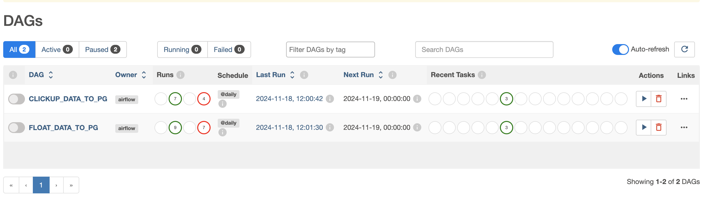
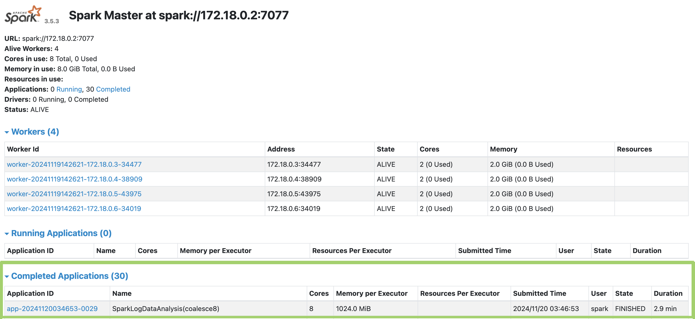

# Sora Union Data Engineer Task

This repo provides a set of preconfigured tools that was used for the Data Engineer recruitment task:

- Apache Airflow
- Apache Spark
- PostgreSQL DB
- DBT
- Docker & Docker compose

Optional tools required
- DBeaver (*or any DB management tool of choice*)
- Cloud Server *(Digital Ocean was used for a part of the task)*

<!-- #### Wirtten docs found [here](https://docs.google.com/document/d/1zXne7qrxWh82c2MWyXX9jwbZLZzW8065SteJIvwY9Lc/edit?usp=sharing)  -->

## Usage
- Use the `make` configurations provided [here](Makefile) to deploy the containers and start the services. 
- Run `make help` to view instructions for starting specific containers tailored to different tasks.


###  1. Data Warehousing & ETL Process
- #### Data warehouse design:
    [Find document Bookmark here](https://docs.google.com/document/d/1zXne7qrxWh82c2MWyXX9jwbZLZzW8065SteJIvwY9Lc/edit?tab=t.0#bookmark=id.sgk2irrp04ai)

- #### ETL process:
     <br> <br>

    Apache Airflow was set up and used to carry out the ETL tasks by connecting to and extracting the Float and ClickUp data from the provided Google Sheets source, based on the sheet ID and name. The data was loaded into a Pandas dataframe, cleaned, wrangled, and then ingested into a PostgreSQL database, which serves as the data warehouse for the task.   <br> <br>

    > Postgres is an operational database (OLTP), which is not ideally suited for analytical workflows. While it is optimized and used by some for analytical processes (OLAP), a better recommendation would be data warehouse solutions like BigQuery or Snowflake <br> <br>

    The DAG codes for the ETL process are available [here](airflow/dags)

    **usage:** <br>
    setup containers: `make up-etl` & `make up-airflow` to start the required services <br>

    access postgres database with:
    * host: `localhost`
    * port: `5432`
    * user: `admin`
    * password: `Password`
    * database name: `postgres` <br> <br>

    Access the Airflow server at `localhost:8080` using the credentials `airflow:airflow`. The DAGs are set up to run hourly but can also be triggered manually to start the process. <br>

    

    The airflow setup requires some variables needs to be added in variables tab on admin menu on the UI
    
    ```bash
        FLOAT_SHEET_ID
        FLOAT_SHEET_NAME
        FLOAT_DWH_TABLE_NAME
        CLICKUP_SHEET_ID 
        CLICKUP_SHEET_NAME
        CLICKUP_DWH_TABLE_NAME 
        POSTGRES_HOST
        POSTGRES_PORT
        POSTGRES_USER
        POSTGRES_PASSWORD 
        POSTGRES_DB
    ```
    

   Trigger the Airflow DAG to perform the three tasks: downloading, transforming, and ingesting data into the database. The workflow is configured to load the cleaned data into the public schema of the database. <br> <br>

    <br> <br>

   build the data models with dbt:
   - `make dbt-deps` to install dependencies required by DBT
   - `make dbt-compile` to compile DBT models to check for errors
   - `make dbt-build` to build DBT models on the database

     <br>
    
    DBT creates all tables according to the model design in the dev schema and runs tests to ensure data integrity.

     <br>

- ####  Data Integrity and cleanliness:
    To ensure data intergrity and cleanliness I used: 

    -  DBT to enforce data quality by applying generic tests [here](dbt_project/models/schema.yaml), to ensure critical columns meet specified rules like: 
        - `Not Null Tests` on `date, client, project, name` columns
        - `Accepted Values Tests`: Ensure boolean fields like `billable` only contain true or false
        - `Consistency Rules`: Validate logical constraints, such as: `start_date` ≤ `end_date` <br>
    
    - Airflow transformation cleans the data during the ETL process


###  2. Database Query Optimization
- The optimized query and its description are available in this [Jupyter notebook](optimized_query/query.ipynb)

 
###  3.  Big Data Processing with Spark or Hive
- #### Spark process:
- For this task, I used Apache Spark to process and analyze a large dataset of Spark job logs from CUHK Labs, with over 33 million records sourced from the [LogHub repository](https://github.com/logpai/loghub). The dataset contains detailed logs of Spark job executions, which provide insights into various aspects of job performance and resource utilization.

    The spark Job code used can be found in the [spark/jobs/spark_analysis.py](spark/jobs/spark_analysis.py) file

    To run this, I set up a Spark cluster using Docker as the host, with one Spark master and four workers, each having 2 cores and 2 GiB of memory. 

    **usage:** <br>
    setup spark containers: 
    - `make up-spark` to spin up the spark containers 
    - download and extract the logs dataset into the `spark/data` folder. <br>

        The extracted file should contain `915` folders with `.log` files within the folders with a total of `3852`  files 

        - **how to download and extract the data:** <br>
          ```bash
            wget "https://zenodo.org/records/8196385/files/Spark.tar.gz?download=1" -O Spark.tar.gz

            tar -xzvf Spark.tar.gz
          ```

         <br>

    - submit the spark job to process the files and aggregate the logs data with `make spark-job`. This will submit spark job to spark cluster via the master url. The spark code is written to dynamically read all the log files in all the sub folders and parse the 33 mllion worth of records for processing.

         <br>

    >  🚨 Note! :
    > The setup was tested on a cloud server, which is recommended over running it on a local machine. This was done using a DigitalOcean Droplet with the following specs: `8 GB Memory / 2 AMD vCPUs / 100 GB Disk / FRA1 - Ubuntu 24.10 x64` <br>


    The result of the aggregation is shown here: <br>

     <br>

- #### Approach and Performance Considerations:

    - **Approach:** The code analyzes log data by extracting relevant fields using regular expressions, then aggregating the data by Component and Hour.
        - Data Extraction: Regular expressions was used to parse and extract the various fields from the raw log data
        - Data Cleaning: Missing or empty Date and Time values were handled with default values, and rows with missing Date were filtered out.
        - Timestamp Creation: The Date and Time columns were combined into a Timestamp and the hour was extracted for aggregation.

    - **Performance Considerations:**
        - Adaptive Query Execution: Spark’s adaptive query execution was enabled to optimize the execution plan at runtime
        - Shuffle Partitions: The `shuffle partitions` were set to `16` to balance the workload and improve parallelism.
        - Coalescing: The number of partitions was reduced to `8` using `coalesce` to optimize performance during aggregation, minimizing the overhead of excessive partitions <br>

            - I was able to run the query to process the `33 million` records within `2.9mins`

             <br>

###  4. Data Modeling Techniques
- #### Data Model Diagrams 
     <br>

     <br>

- #### Design Decisions
    [Find document Bookmark here](https://docs.google.com/document/d/1zXne7qrxWh82c2MWyXX9jwbZLZzW8065SteJIvwY9Lc/edit?tab=t.0#bookmark=id.qw4cqseke0xr)
   